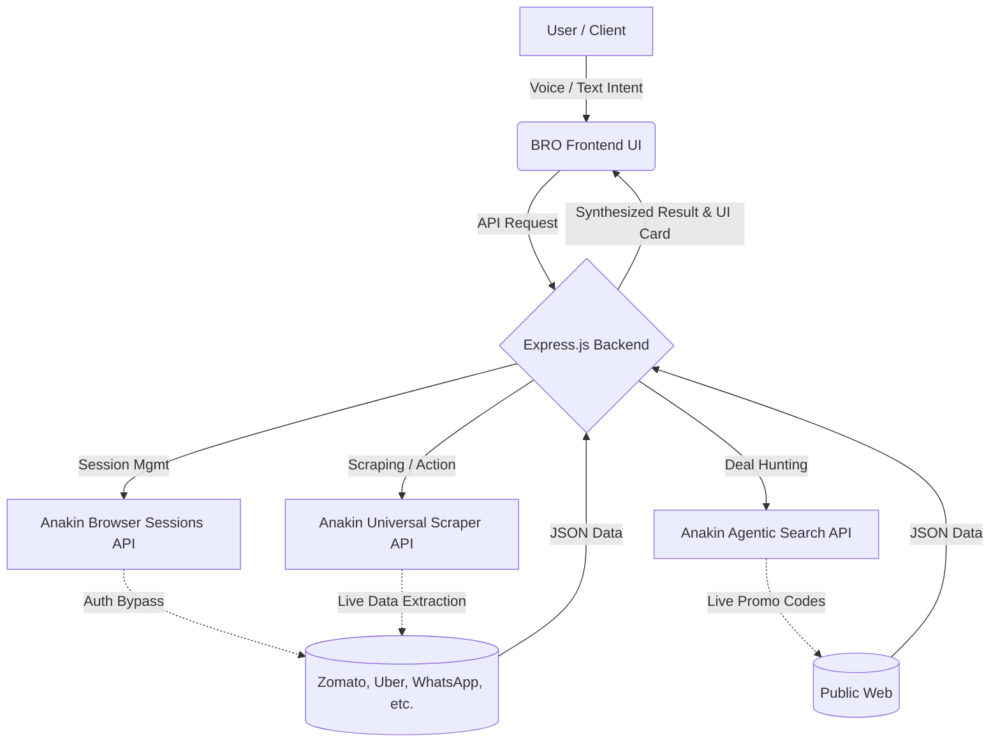
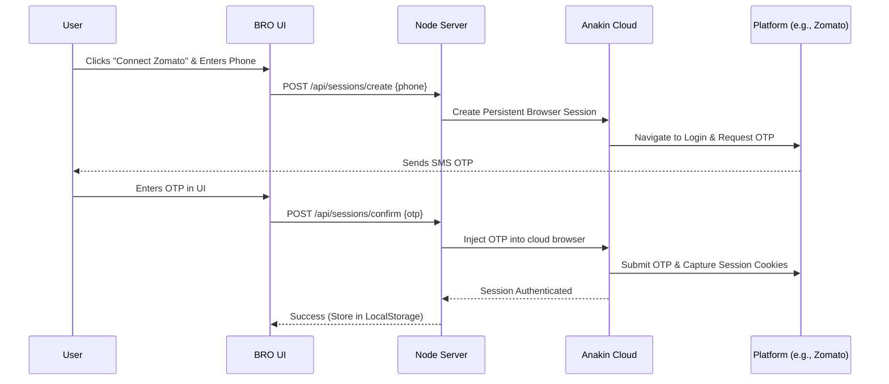

# BRO — Multi-Platform AI Assistant 🎯

**BRO** is an intelligent voice and text-based AI assistant built for the **Anakin.io Hackathon**. It acts as a centralized dashboard, aggregating live data from your favorite platforms like Zomato, Swiggy, Uber, Ola, Rapido, WhatsApp, and Gmail, providing a unified, hands-free experience.

## ✨ Key Features
- **Centralized Dashboard**: A minimalist, dark-and-light-mode capable AI chat interface where users can order food, book rides, or send messages using natural language.
- **Multi-Platform Authentication**: Users can connect their personal accounts securely (via Phone OTP or Google OAuth) for platforms like Uber, Zomato, WhatsApp, and Gmail.
- **Live Deal Scraping**: Powered by Anakin.io APIs, BRO fetches live pricing, compares delivery fees, and automatically applies active promo codes from the web.
- **Auto-Messaging**: Ask BRO to send the "best deals of the day" directly to your WhatsApp or Gmail, and it will handle the automation behind the scenes.
- **Voice Commands**: Fully integrated speech-to-text functionality for a true AI assistant experience.

## 🚀 Built With
- **Frontend**: Vanilla JavaScript, HTML5, Modern CSS3 (Glassmorphism, Minimalist Light Theme).
- **Backend**: Node.js & Express.
- **APIs**:
  - **Anakin.io Browser Sessions**: To bypass login walls and maintain authenticated sessions for scraping personal data.
  - **Anakin.io Universal Scraper**: To parse and extract clean JSON data from dynamic platforms without writing complex CSS selectors.
  - **Anakin.io Agentic Search**: To hunt for the latest working promo codes across the internet in real-time.

## 💻 Running Locally

1. Clone the repository:
   ```bash
   git clone https://github.com/kirtan9207/MULTI-MODEL-AI-ASSISTANCE.git
   cd MULTI-MODEL-AI-ASSISTANCE
   ```

2. Install dependencies:
   ```bash
   npm install
   ```

3. Start the local server:
   ```bash
   npm run dev
   ```

4. Open your browser and navigate to:
   ```
   http://localhost:3000
   ```

## 📂 Project Structure
- `/public`: Contains all static frontend assets (HTML, CSS, JS, Images).
- `/server`: Node.js backend server handling API routes and Anakin integration logic.
- `index.html`: The main Chat AI Assistant dashboard.
- `accounts.html`: The secure platform connection portal.

## 🏗️ High-Level Design (HLD)

BRO's architecture is built to seamlessly bridge the gap between user intent and multi-platform execution without relying on direct 3rd-party API access (which is often restricted).



## 🔄 Low-Level Design (LLD): Account Connection Flow

Connecting a user's third-party account securely without breaking CAPTCHAs or IP bans.

